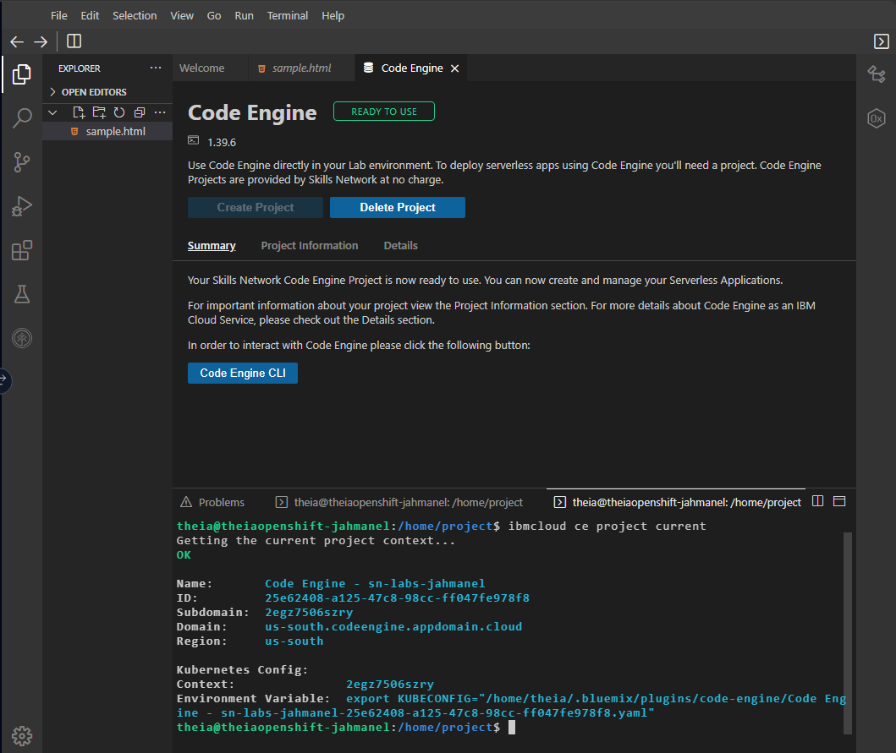
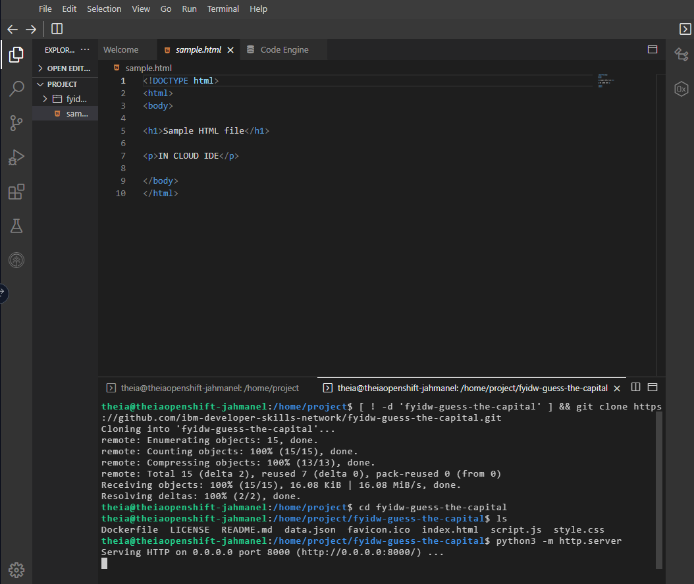
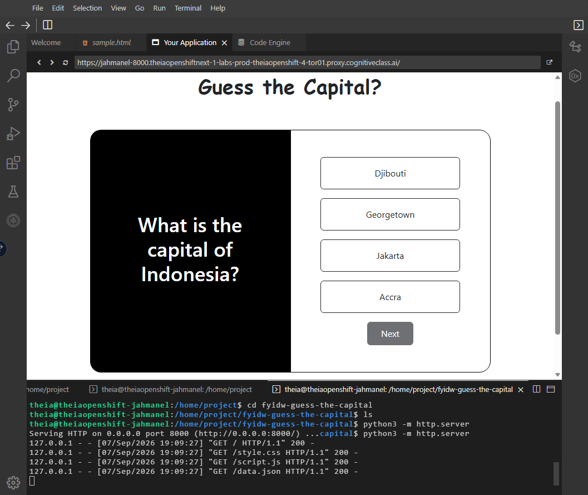
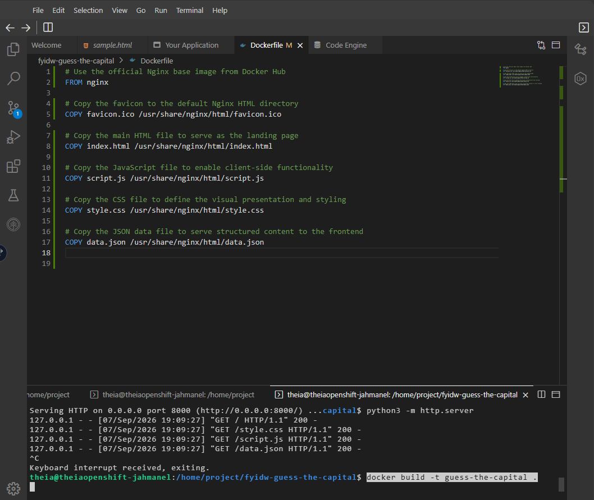
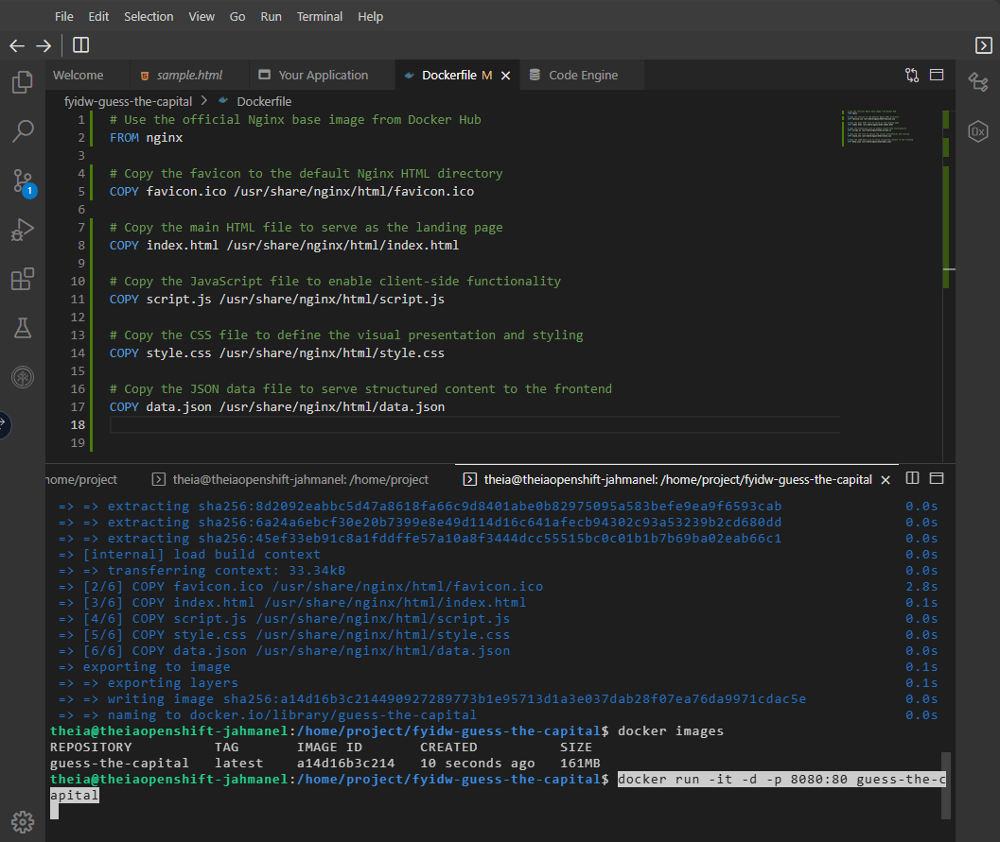
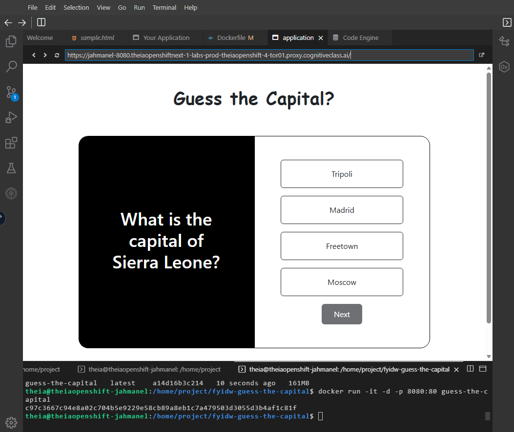
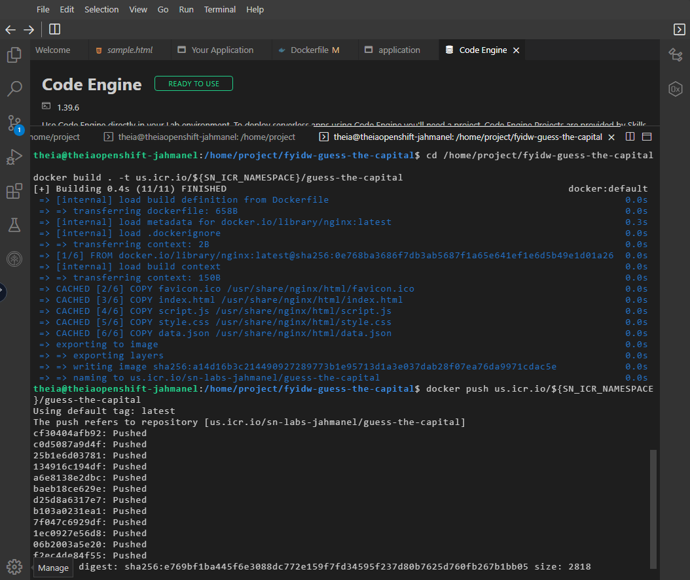
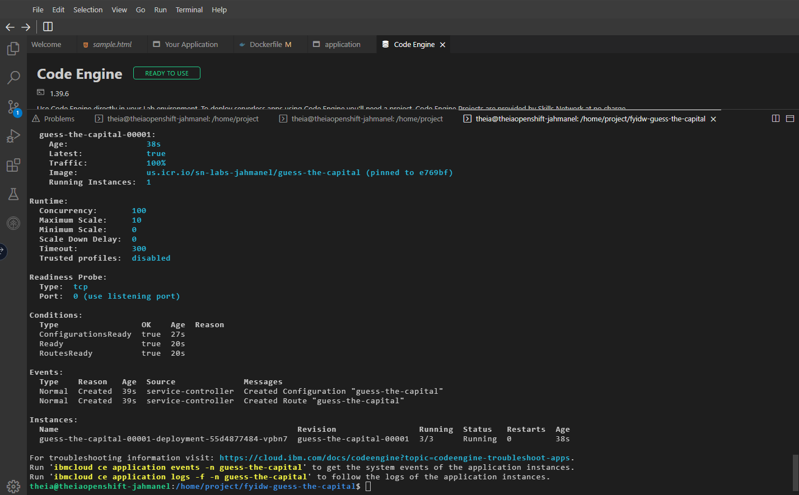

# Guess the Capital — Containerized & Deployed to IBM Cloud

A hands-on project completed as part of IBM's **Introduction to Cloud Computing** course (part of the [IBM Hybrid Cloud Architect Professional Certificate](https://www.coursera.org/professional-certificates/ibm-hybrid-cloud-architect) on Coursera).

## What this project demonstrates

The frontend web app itself ("Guess the Capital," a simple geography quiz) is a starter template provided by IBM's developer-skills-network. **My work here is the containerization and cloud deployment pipeline** — taking a static web app from source code to a live, serverless deployment on IBM Cloud. This project was my first hands-on exposure to:

- Writing a **Dockerfile** to containerize a static web application
- Building and running a Docker image locally to verify functionality
- Pushing a container image to a **private cloud image registry** (IBM Cloud Container Registry)
- Deploying a containerized app to a **serverless compute platform** (IBM Cloud Code Engine)

## Pipeline overview

**1. Environment setup**
Provisioned a cloud-based development environment (Theia IDE) with Docker and the IBM Cloud CLI pre-configured, and initialized an IBM Cloud Code Engine project for serverless deployment.

**2. Cloned the starter application and ran it locally**
```bash
git clone https://github.com/ibm-developer-skills-network/fyidw-guess-the-capital.git
cd fyidw-guess-the-capital
python3 -m http.server
```
Verified the app ran correctly in a browser before containerizing it.

**3. Wrote the Dockerfile**
Used the official `nginx` base image and copied over the app's static assets:
```dockerfile
FROM nginx
COPY favicon.ico /usr/share/nginx/html/favicon.ico
COPY index.html /usr/share/nginx/html/index.html
COPY script.js /usr/share/nginx/html/script.js
COPY style.css /usr/share/nginx/html/style.css
COPY data.json /usr/share/nginx/html/data.json
```
See [`app/Dockerfile`](./app/Dockerfile).

**4. Built and tested the container image locally**
```bash
docker build -t guess-the-capital .
docker run -it -d -p 8080:80 guess-the-capital
```
Confirmed the containerized app served correctly on `localhost:8080` before deploying it anywhere.

**5. Pushed the image to IBM Cloud Container Registry**
```bash
docker build . -t us.icr.io/${SN_ICR_NAMESPACE}/guess-the-capital
docker push us.icr.io/${SN_ICR_NAMESPACE}/guess-the-capital
```

**6. Deployed as a serverless application on IBM Cloud Code Engine**
The app was deployed directly from the pushed image, with Code Engine handling scaling, routing, and providing a public HTTPS endpoint — no server management required.

## Result

A fully live, publicly accessible, containerized web application running on serverless infrastructure — deployed without provisioning or managing a single server.

## Screenshots

| Step | Screenshot |
|---|---|
| Code Engine project setup |  |
| Cloning the repo & running locally |  |
| App running locally |  |
| Writing the Dockerfile & building the image |  |
| Docker image built and run locally |  |
| Containerized app running |  |
| Pushing the image to IBM Cloud Container Registry |  |
| Live deployment on Code Engine |  |

## Tech used

`Docker` · `Nginx` · `IBM Cloud Container Registry` · `IBM Cloud Code Engine` · `Serverless Computing` · `Git`

## Credit

Application source (`index.html`, `script.js`, `style.css`, `data.json`, `favicon.ico`) provided by [IBM Developer Skills Network](https://github.com/ibm-developer-skills-network/fyidw-guess-the-capital) under the Apache 2.0 License. My contribution is the Dockerfile and the full containerization/deployment pipeline documented above.

---

*Elijah Cordova — working toward a DevOps/Cloud Engineering role. Part of my progress through the [IBM Hybrid Cloud Architect Professional Certificate](https://www.coursera.org/professional-certificates/ibm-hybrid-cloud-architect).*
